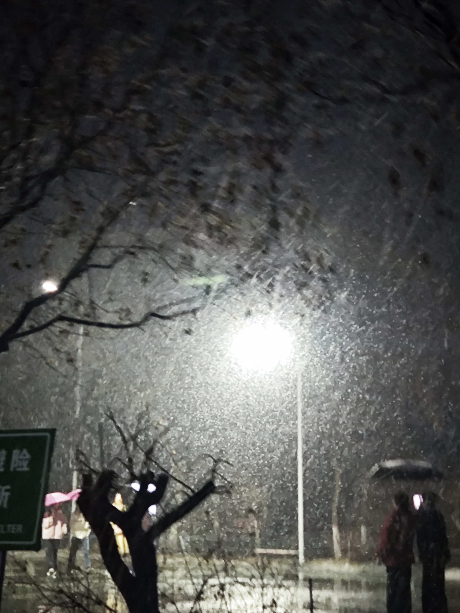
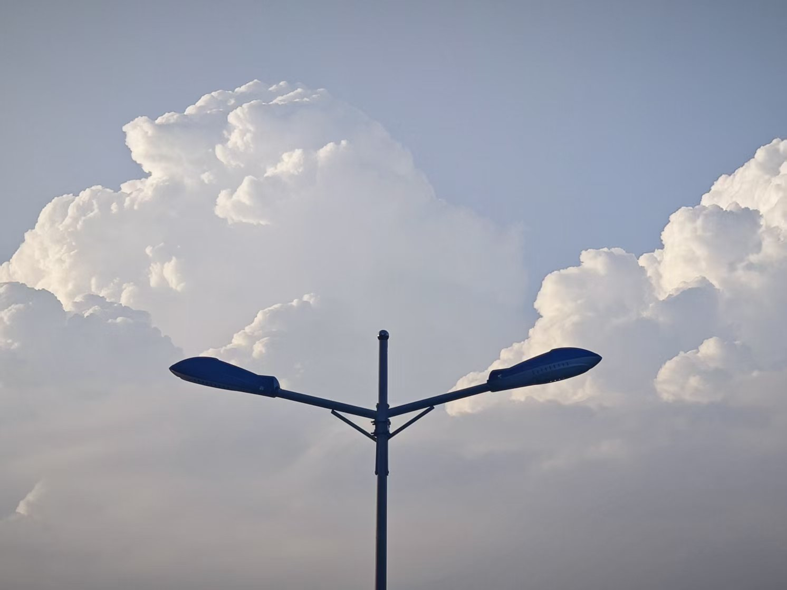
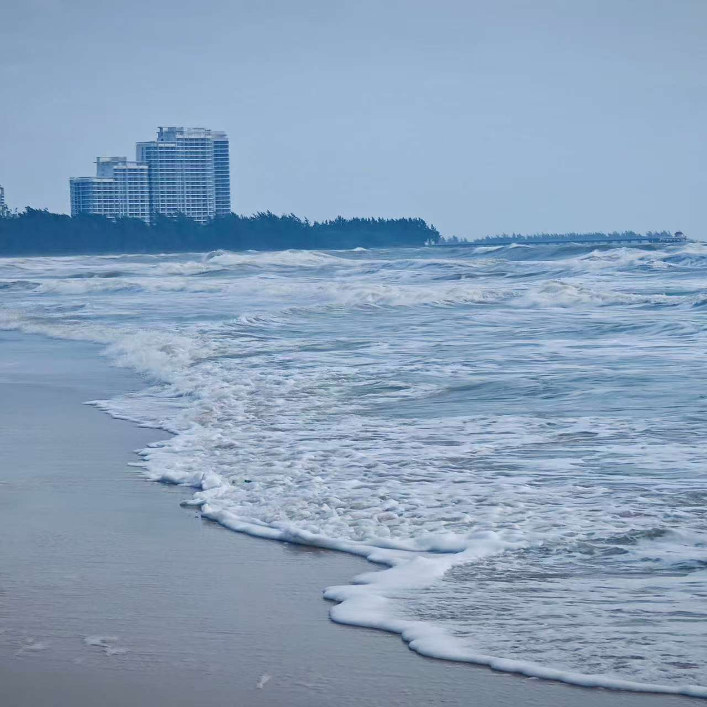

( •̀ ω •́ )✧
<div class="tenor-gif-embed" data-postid="6693631120763220178" data-share-method="host" data-aspect-ratio="1" data-width="100%"><a href="https://tenor.com/view/surfing-nyan-cat-sunglasses-sunset-rainbows-gif-6693631120763220178">Surfing Nyan Cat GIF</a>from <a href="https://tenor.com/search/surfing-gifs">Surfing GIFs</a></div> <script type="text/javascript" async src="https://tenor.com/embed.js"></script>
你好，我是饿梦～

喜欢听音乐、喜欢看很多书，很多电影，喜欢到处乱跑、喜欢按快门、喜欢写一些没什么用的代码。

有一个 [博客](https://emdream.icu/) ，偶尔更新，不定期失联。

```python
me = {
    "name":     "饿梦 (Hungerdream)",
    "location": "地球某个角落",
    "music":    "随时随地，耳机不摘（当然，有时候也会停下来看看风景的啦）",
    "travel":   "下一个目的地永远已经在计划中（计划好多，工作是旅行就好了）",
    "camera":   "用眼睛记录一起，偶然也会拍照，最快乐的是生活",
    "code":     "偶尔也写点有用的东西,(偶然让AI给我写点有用的东西)",
}
```

------

**一些个人项目**

[番茄钟](https://github.com/Hungerdream/FanqieClock)、[声屿笺博客系统](https://github.com/Hungerdream/shengyu-blog)、

------

**一些照片**

<table>
  <tr>
    <td></td>
    <td></td>
    <td></td>
  </tr>
</table>


<!-- 把旅途中拍的照片放这里 -->


